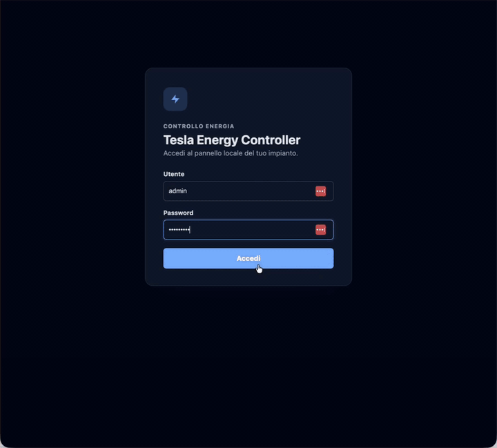

# Tesla Energy Controller

English version: [README.en.md](README.en.md)

## Demo prodotto

[](docs/assets/tesla-energy-controller-demo.mp4)

Preview inline della dashboard. Clicca sull'anteprima per aprire il video MP4 originale.

## Materiali presentazione

- [Presentazione tecnica PDF](docs/presentation/tesla-energy-controller-presentation.pdf)
- [Presentazione tecnica HTML](docs/presentation/tesla-energy-controller-presentation.html)
- [Anteprima HTML renderizzata](https://htmlpreview.github.io/?https://github.com/CryptoStatistical/tesla_energy_controller/blob/main/docs/presentation/tesla-energy-controller-presentation.html)

Servizio Python che campiona produzione, consumo casa e stato Tesla in una rolling window RAM e
salva/decide ogni 5 minuti per storico SQLite e controller. Prima del salvataggio applica una EWMA
sugli ultimi 5 minuti, con peso maggiore ai valori più recenti. Dashboard e Tuya possono
rinfrescare lo stato/cache più spesso senza creare nuovi campioni.
Se la Tesla è già in stato `Charging`, converte il budget disponibile in corrente di ricarica:
potenza FV utilizzabile più extra rete configurata, meno consumo casa. Con
`CONTROL_MODE=solar-production` non è necessario un contatore bidirezionale di rete.

Il calcolo operativo è `ampere = floor((produzione FV W + extra rete W - consumo casa W) /
(tensione × fasi))`: a 230 V trifase ogni ampere corrisponde a circa 690 W. Sono comunque
disponibili le sorgenti di rete per una futura modalità `CONTROL_MODE=grid-surplus`.

## Scelte di sicurezza

- `MODE=dry-run` è il default: calcola e registra la decisione senza inviare comandi.
- Verifica che la Tesla stia caricando realmente su tre fasi; un numero di fasi inatteso blocca
  il ciclo.
- Usa la tensione letta dall'auto e la relazione trifase `W/A = 3 × tensione di fase`.
- Se il contatore Modbus espone le potenze L1/L2/L3, limita l'aumento sulla fase più caricata.
- Aumenta al massimo di 2 A per ciclo, riduce subito, applica isteresi di 1 A e non sveglia
  un'auto addormentata.
- Avvia o arresta la ricarica soltanto per una sospensione economica decisa dal ramo ALFA;
  nelle modalità precedenti regola solamente una sessione già attiva.
- In caso di errore di rete/dati non viene inviato alcun comando.
- Nella logica storica, sotto la potenza necessaria a `MIN_CHARGE_AMPS` la corrente viene limitata
  a quel minimo. Con ALFA/quota potenza attiva, invece, `MIN_CHARGE_AMPS` è un minimo ordinario:
  il controller può scendere sotto quel valore, o fermare/riprendere, per restare dentro la quota.

## Modalità di controllo

`solar-production` usa direttamente la produzione istantanea dell'inverter e non insegue lo
zero import/export come feedback di rete. Nel giro dashboard/scheduler il target Tesla è però
limitato dal budget configurato: produzione FV utilizzabile più quota extra rete ammessa, meno
consumo casa Vimar.

`grid-surplus` usa invece import/export e richiede un contatore/CT SolarEdge configurato come
`Export + Import`, oppure un contatore Modbus trifase.

`meter-closed-loop` usa import/export letti da un contatore reale, per esempio ALFA by Sinapsi,
come feedback autorevole. Con l'opzione ALFA attiva l'export disponibile aumenta la corrente
entro la rampa configurata; il prelievo viene invece confrontato con la proiezione della media
su 15 minuti, così gli spike brevi non vengono trattati come nuova quota di potenza.

## Prova locale senza credenziali

```bash
cp .env.example .env
python3 -m venv .venv
. .venv/bin/activate
pip install -e '.[dev]'
tesla-energy-controller once
pytest
```

Il risultato atteso con i mock è un'azione `dry-run` che propone un aumento di corrente.

## Indirizzi e host configurabili

Gli indirizzi di rete non devono stare nel codice. Configurarli nel `.env` locale:

| Dispositivo/servizio | Variabile |
| --- | --- |
| ALFA Sinapsi Modbus TCP | `ALFA_MODBUS_HOST`, `ALFA_MODBUS_PORT`, `ALFA_MODBUS_UNIT` |
| Vimar By-me Plus / AG+ | `VIMAR_HOST`, `VIMAR_PORT`, `VIMAR_DEVICE_UID` |
| SolarEdge Modbus TCP | `SOLAREDGE_MODBUS_HOST`, `SOLAREDGE_MODBUS_PORT`, `SOLAREDGE_MODBUS_UNIT` |
| Tesla Fleet proxy/API | `TESLA_API_BASE_URL` |
| Tuya MQTT | `TUYA_MQTT_HOST`, `TUYA_MQTT_PORT` |
| Pannello web locale | `WEB_HOST`, `WEB_PORT` |

`ENERGY_SOURCE=solaredge-modbus` è il default operativo letto all'avvio. Nel pannello admin, in
**Impostazioni → Ricarica → Fotovoltaico**, si può comunque scegliere a runtime la sorgente FV:
`SolarEdge Modbus TCP`, `SolarEdge web` o le sorgenti già configurate. Quando è selezionato
`SolarEdge Modbus TCP`, il servizio legge direttamente Modbus e non apre il portale SolarEdge web.
In modalità normale con SolarEdge web/cloud più ALFA, `ALFA_MODBUS_HOST` viene usato come misura
separata del contatore quando nel pannello è attiva **Attiva Lettura rete da ALFA Sinapsi**.

## Pacchetto Raspberry Pi

Per preparare da Mac/Linux un bundle installabile su Raspberry Pi OS 64-bit:

```bash
bash scripts/package_raspberry_pi.sh
scp dist/tesla-energy-controller-raspberry-arm64.tar.gz utente@raspberry-pi:/tmp/
ssh utente@raspberry-pi
cd /tmp
tar -xzf tesla-energy-controller-raspberry-arm64.tar.gz
cd tesla-energy-controller-raspberry-arm64
sudo ./install_on_raspberry_pi.sh
```

Il bundle contiene le wheel Linux ARM64, le unità systemd, gli script BLE e `.env.example`.
L'installer non avvia il servizio finché non sono stati configurati `.env`, `tesla-control` e la
chiave BLE Tesla.

## Configurazione SolarEdge

### Modbus TCP (raccomandato)

1. Dalla messa in servizio/SetApp abilitare `Modbus TCP` sull'inverter.
2. Riservare l'IP dell'inverter nel router.
3. Impostare in `.env` host, porta e unit ID Modbus. `ENERGY_SOURCE=solaredge-modbus`
   è il default consigliato; il portale web SolarEdge resta un fallback selezionabile dal pannello admin.
4. Lasciare `MODE=dry-run` ed eseguire `tesla-energy-controller doctor` mentre l'auto carica.
5. Confrontare il segno e i watt del log con mySolarEdge. Se il verso è opposto, impostare
   `SOLAREDGE_GRID_POWER_SIGN=-1`.

Parametri tipici StorEdge/SunSpec:

```dotenv
SOLAREDGE_MODBUS_HOST=192.168.x.y
SOLAREDGE_MODBUS_PORT=1502
SOLAREDGE_MODBUS_UNIT=1
SOLAREDGE_MODBUS_POLL_INTERVAL_SECONDS=30
SOLAREDGE_INVERTER_BASE=40069
SOLAREDGE_METER_BASE=40121
```

Il modello inverter SunSpec `101-104` fornisce la produzione FV istantanea. Il modello meter
`201-204`, se presente, aggiunge import/export; se non è disponibile, la sorgente Modbus resta
valida per il FV e non fa fallback al portale web.

Se l'inverter è dietro un MikroTik/AP con NAT o una sottorete separata, il deploy installa anche
`tesla-energy-controller-network.service`: un bootstrap di rete Raspberry che viene eseguito al
boot prima dei controller web/Tuya.

Configurazione predefinita in `/etc/default/tesla-energy-controller-network`:

```dotenv
NETWORK_DEVICE=wlan0
STOREDGE_ROUTE_ENABLED=true
STOREDGE_ROUTE_CIDR=192.168.20.0/24
STOREDGE_ROUTE_GATEWAY=192.168.1.1
ALFA_NEIGHBOR_ENABLED=true
ALFA_NEIGHBOR_IP=192.168.1.50
ALFA_NEIGHBOR_MAC=aa:bb:cc:dd:ee:ff
ALFA_MODBUS_PORT=502
```

Lo script applica in modo idempotente:

```bash
ip route replace 192.168.20.0/24 via 192.168.1.1 dev wlan0
ip neigh replace 192.168.1.50 lladdr aa:bb:cc:dd:ee:ff dev wlan0 nud permanent
```

La rotta serve a raggiungere lo StorEdge in una subnet separata; il neighbor statico ALFA compensa gli AP
non in mesh, dove ARP/broadcast tra client non attraversa correttamente i segmenti Wi-Fi.

### ALFA Modbus su contatore Enel

Per usare ALFA by Sinapsi come misura autorevole del contatore:

```dotenv
ENERGY_SOURCE=alfa-modbus
CONTROL_MODE=meter-closed-loop
ALFA_MODBUS_HOST=192.168.x.y
ALFA_MODBUS_PORT=502
ALFA_MODBUS_UNIT=1
POWER_QUOTA_TARGET_W=7000
POWER_QUOTA_HYSTERESIS_W=500
GRID_HOLD_BAND_W=200
POLL_INTERVAL_SECONDS=300
```

Nel pannello, sotto **Advanced configuration**, l'opzione
**Attiva Lettura rete da ALFA Sinapsi** è disattivata per default. Quando è spenta il pannello
mantiene logica e interfaccia storiche della main, con import/export stimati e Casa ricavata dai
carichi Vimar. Quando è attiva usa import/export ALFA, abilita il feedback meter closed-loop e
mostra la scomposizione Elettrodomestici/Device.

Il feedback ALFA viene elaborato sul campione storico di `POLL_INTERVAL_SECONDS` (300 secondi di
default), così decisioni e salvataggi SQLite restano allineati ai blocchi da cinque minuti. Per la
quota economica queste letture vengono aggregate in tre slot allineati da cinque minuti, usati per
approssimare la potenza media del quarto d'ora. La dashboard mostra come **Quota Potenza** il massimo mensile
raggiunto tra tutti i quarti completi. Durante il quarto corrente il controller proietta gli slot mancanti
mantenendo il prelievo ALFA più recente. L'obiettivo configurato resta la soglia da rispettare
anche se nel mese si è già verificato uno sforamento; il picco maturato viene mostrato
separatamente in dashboard.

Con ALFA la **quota potenza** è il limite hard. L'**extra rete** resta un target soft quando c'è
solare: il controller prova a non importare oltre quella quota aggiuntiva, ma non sospende la
Tesla se la quota potenza ha ancora margine. Se il solare cala o manca, il controller usa il
margine `quota potenza - import ALFA` per continuare a caricare, anche sotto `MIN_CHARGE_AMPS`
quando serve. Se la proiezione supera soglia e margine, la corrente Tesla scende senza attendere
l'isteresi ordinaria; quando non c'è nemmeno 1 A compatibile con la quota, invia `charging-stop` e
poi `charging-start` appena la ripartenza rientra sotto soglia con il margine configurato. Questa
sospensione è una scelta economica, non una protezione dalla potenza disponibile del contatore.

I registri di controllo usati sono quelli della configurazione Home Assistant ALFA: `2` import W,
`12` export W e `5/15` energie totali import/export Wh. Quando `ENERGY_SOURCE` resta SolarEdge
e l'opzione ALFA è attiva, il servizio continua a prendere la produzione FV da SolarEdge e usa
ALFA solo come misura autorevole del contatore di scambio. Il registro `921` produzione FV e
`924` energia prodotta vengono letti solo se disponibili, ma non sono necessari per il controllo
import/export.

Il client legge anche diagnostica non invasiva: `9/19` medie quartorarie import/export, `203` tempo residuo
distacco, `30/32/34` e `54/56/58` energie F1/F2/F3 del giorno precedente, `780` fascia corrente e
`782` evento grezzo. Questi campi vengono esposti nello stato ma non comandano ancora la Tesla:
prima vanno validati contro l'interfaccia ALFA e la mappa registri del firmware installato.

Il contatore di scambio misura direttamente solo prelievo e immissione; non misura la produzione
FV totale già autoconsumata a monte. ALFA non espone un registro di consumo totale: la dashboard
lo ricostruisce dal saldo della rete e dalla produzione SolarEdge. `Elettrodomestici` è la somma dei carichi Vimar; `Device` è
`(import - export) reale - (import - export) stimato`; `Casa` è `Elettrodomestici + Device` e il
consumo totale è `Casa + Tesla`. Vimar resta il dettaglio dei carichi e delle anomalie, non la
sorgente per il limite del contatore. Prima del live verificare dal Raspberry che i registri
import/export ALFA coincidano con i valori dell'interfaccia ALFA/contatore.

### Portale web con username/password

Questa modalità usa la sessione privata del portale Monitoring e non richiede una API key.
È necessariamente più fragile di un'API pubblica: SolarEdge può modificare login o endpoint.

Salvare le credenziali senza scriverle nella cronologia del terminale:

```bash
bash scripts/setup_solaredge_credentials.sh
```

Impostare `ENERGY_SOURCE=solaredge-web` e il proprio `SOLAREDGE_SITE_ID`. Il servizio esegue
il flusso Cognito PKCE solo quando serve: la sessione viene mantenuta e **persistita su disco**
(`SOLAREDGE_SESSION_FILE`, default `.secrets/solaredge_session.json`), così a ogni riavvio si
riusa il `refresh_token` con un refresh leggero invece di rifare il login completo. Il login OAuth
completo resta come ripiego (primo avvio o refresh scaduto, es. 401/403). Se l'account
richiede MFA, il login completamente automatico viene fermato in sicurezza e va aggiunto un
onboarding interattivo per quel secondo fattore.

Per non sovraccaricare il portale (integrazione non ufficiale), la sorgente web esegue al massimo
**una lettura ogni `CLOUD_POLL_INTERVAL_SECONDS`** (default 300s): le chiamate più frequenti — ad
esempio i report del bridge Tuya ogni `TUYA_REPORT_INTERVAL_SECONDS` — riusano l'ultima misura in
cache invece di interrogare di nuovo SolarEdge.

Le credenziali possono essere inserite direttamente nell'`.env` non tracciato:

```dotenv
SOLAREDGE_USERNAME=nome@example.com
SOLAREDGE_PASSWORD=password-personale
```

In alternativa restano supportati `SOLAREDGE_USERNAME_FILE` e `SOLAREDGE_PASSWORD_FILE`.

### Diagnostica SolarEdge e report via mail

Se il login SolarEdge o la lettura power-flow falliscono, il servizio crea una diagnostica
strutturata con fase del flusso, endpoint senza query string, codice HTTP, estratto sicuro della
risposta e suggerimenti operativi. La dashboard mostra questi dettagli nel blocco
`Diagnostica`, e `/api/status` li espone nel campo `debug`.

Per ricevere il report via mail in caso di errore SolarEdge configurare l'endpoint WordPress
nell'`.env`:

```dotenv
ERROR_REPORT_EMAIL_ENABLED=true
ERROR_REPORT_EMAIL_ON_SOLAREDGE_FAILURE=true
ERROR_REPORT_EMAIL_COOLDOWN_SECONDS=3600
NOTIFY_BACKEND=wordpress
NOTIFY_RECIPIENTS=destinatario@example.com
NOTIFY_API_URL=https://example.com/wp-json/custom/v1/send-email
NOTIFY_API_KEY_FILE=.secrets/notify_api_key
NOTIFY_API_USER_FILE=.secrets/notify_api_user
```

Provare la configurazione senza attendere un guasto reale:

```bash
tesla-energy-controller report-test
```

Il cooldown evita una mail ogni ciclo se SolarEdge resta irraggiungibile. I report non includono
password SolarEdge, token OAuth, cookie o contenuto dell'`.env`.

### Monitoring API cloud

Creare `.secrets/solaredge_api_key` e incollare lì solamente la API key, quindi:

```bash
chmod 600 .secrets/solaredge_api_key
```

In `.env` impostare `ENERGY_SOURCE=solaredge-cloud`, `SOLAREDGE_SITE_ID` e lasciare
`CLOUD_POLL_INTERVAL_SECONDS=300`. La chiave API è disponibile solo a utenti con il livello di
accesso appropriato; se la sezione API non compare nel portale Monitoring occorre chiederne
l'abilitazione all'installatore/amministratore del sito. Non servono email e password SolarEdge.

## Configurazione Tesla BLE ufficiale

Sul Raspberry vicino all'auto viene usato `tesla-control` dal progetto ufficiale
[`teslamotors/vehicle-command`](https://github.com/teslamotors/vehicle-command). Il collegamento
Bluetooth non richiede username/password Tesla, Fleet API, OAuth o un dominio pubblico.

### Architettura scelta per Raspberry Pi Zero 2 W

Il progetto usa l'opzione CLI: Python esegue il binario ufficiale per operazioni brevi e tutte
le chiamate BLE sono serializzate da un unico mutex. È una scelta adatta qui perché decisioni e
scritture SQLite avvengono ogni 300 secondi; i comandi sono al massimo due per ciclo e la session cache evita handshake
inutili. Un proxy Go/MQTT persistente aggiungerebbe processi e memoria su una macchina da 512 MB
senza un vantaggio proporzionato per questo carico.

Il preflight `body-controller-state` legge lo stato sleep tramite VCSEC. Se l'auto è addormentata,
il ciclo termina e non esegue `state charge`; il software non invia mai `wake`. Se è sveglia,
legge lo stato di carica e continua soltanto con `Charging`.

1. Installare Raspberry Pi OS Lite **64-bit** sulla Zero 2 W. Su un Mac/Linux più potente,
   installare Go+git oppure Docker e preparare il binario ARM64 della release Tesla fissata:

   ```bash
   bash scripts/build_tesla_control_arm64.sh v0.4.1
   scp dist/tesla-control-linux-arm64 utente@raspberry-pi:/tmp/
   ```

2. Sul Raspberry installare BlueZ, il binario e la capability BLE senza eseguire l'app come root:

   ```bash
   sudo bash scripts/provision_raspberry_pi.sh /tmp/tesla-control-linux-arm64
   getcap /usr/local/bin/tesla-control
   bluetoothctl show
   timedatectl show -p NTPSynchronized
   ```

   La capability `cap_net_admin` viene persa quando il binario viene sostituito: lo script di
   provisioning la riapplica a ogni installazione.

3. Generare la chiave privata locale e abbinare il ruolo minimo `charging_manager`:

   ```bash
   bash scripts/generate_tesla_keys.sh
   bash scripts/pair_tesla_ble.sh
   ```

4. Quando richiesto, appoggiare la chiave NFC Tesla sulla console centrale. La chiave privata
   `.secrets/tesla/private-key.pem` deve restare soltanto sul Raspberry.
5. Impostare in `.env`:

   ```dotenv
   TESLA_MOCK=false
   TESLA_TRANSPORT=ble
   TESLA_VIN=IL_VIN_DELL_AUTO
   TESLA_CONTROL_BINARY=/usr/local/bin/tesla-control
   TESLA_BLE_ADAPTER=hci0
   TESLA_BLE_REQUIRE_TIME_SYNC=true
   TESLA_BLE_PREFLIGHT_SLEEP_CHECK=true
   TESLA_BLE_RETRIES=2
   TESLA_DATA_SOURCE=vehicle
   ```

`TESLA_DATA_SOURCE=vehicle` è il default: il monitoraggio legge la Tesla via BLE con `state charge`
e usa stato, tensione, corrente, fasi e `chargerPower` quando presente. Normalmente invia
`charging-set-amps`; con ALFA attiva può usare anche `charging-stop` e `charging-start` per
rispettare la quota quartoraria. Errori di
beacon/raggio e BlueZ vengono ritentati con backoff esponenziale e jitter; errori di chiave,
ruolo o orologio non vengono ritentati alla cieca. L'invio è bloccato finché NTP non risulta
sincronizzato.

Se il payload BLE riporta un numero fasi diverso da 1 o 3, il parser inferisce il valore da
potenza, tensione e corrente. Questo copre letture reali in cui Tesla espone `chargerPhases=2`
ma `chargerPower / (chargerVoltage × chargerActualCurrent)` indica una ricarica trifase.

In alternativa si può leggere la potenza Tesla dal Wall Connector Gen 3 locale, senza interrogare
la Tesla e senza svegliarla:

```dotenv
TESLA_DATA_SOURCE=wall-connector
WALL_CONNECTOR_HOST=wall-connector-hostname-or-ip
WALL_CONNECTOR_PHASES=3
WALL_CONNECTOR_POLL_INTERVAL_SECONDS=15
WALL_CONNECTOR_TIMEOUT_SECONDS=3
WALL_CONNECTOR_MIN_CURRENT_A=0.3
```

In questa modalità il ciclo legge `http://WALL_CONNECTOR_HOST/api/1/vitals` al massimo ogni
`WALL_CONNECTOR_POLL_INTERVAL_SECONDS` secondi e calcola la potenza da `grid_v`,
`vehicle_current_a` e numero fasi attive. Se `vehicle_connected=false` e `contactor_closed=false`,
le piccole correnti residue vengono considerate rumore e Tesla vale 0 W.

`TESLA_DATA_SOURCE=wall-connector` riguarda solo la misura della potenza Tesla: in standby non
chiama `tesla-control state charge` e quindi non sveglia l'auto, ma il BLE resta configurato e
visibile in dashboard. Quando il Wall Connector indica ricarica attiva o assorbimento reale e il
controller è acceso nella finestra solare, il ciclo legge la Tesla via BLE per ottenere lo stato
di carica e inviare eventuali comandi di cambio ampere. La dashboard mostra quindi due stati
separati: sorgente misura Tesla (`Bluetooth Tesla` o `Wall Connector`) e controllo BLE
(`standby`, `pronto`, `offline`).

La dashboard espone lo stato Tesla BLE senza mostrare VIN completo o percorsi sensibili: trasporto,
binario, adapter, chiave configurata, session cache, preflight sleep, NTP e recovery. Dal pannello
admin si possono regolare timeout connessione, timeout comando, numero di retry e recovery adapter;
VIN, percorso chiave, binario e limiti hardware restano nell'`.env`.

Ogni errore del monitoraggio o del controller viene salvato anche negli eventi SQLite con dettagli
diagnostici. Gli errori Tesla BLE sono classificati come `out_of_range`, `ble_stack`, `auth`,
`clock`, `car_state` o `unknown`, così da capire da remoto se il problema è distanza, Bluetooth,
chiave, orologio o stato dell'auto.

La Zero 2 W condivide antenna e radio tra Wi-Fi 2,4 GHz e Bluetooth: va collocata vicino all'auto,
idealmente senza muri. Se il BLE è instabile, ridurre il traffico Wi-Fi o usare un adattatore
USB-Ethernet. `tesla-control` non espone un RSSI affidabile nella sua uscita, quindi la dashboard
può mostrare errori/ripetizioni ma non una misura RSSI reale. Dopo avere verificato manualmente
che `bluetoothctl power off/on` funzioni con l'utente del servizio, si può abilitare
`TESLA_BLE_RECOVERY_ENABLED=true` per il reset automatico dopo la soglia configurata.

## Pannello web e scheduler

Il pannello è realizzato con Flask e template Jinja dinamici, con dashboard responsive
servita interamente dal Raspberry: CSS, JavaScript e Chart.js sono asset locali, senza Node.js
o CDN. La pagina aggiorna stato, metriche, grafici, eventi e salvataggi tramite endpoint JSON
autenticati sullo stesso processo Flask/Waitress, mantenendo i form HTML come fallback.
Stato e metriche si aggiornano da soli ogni ~30 s e i grafici ogni ~30 s, via JavaScript e senza
ricaricare la pagina. I riquadri mostrano il dato del campione EWMA corrente, non letture raw
istantanee.
Login e dashboard condividono lo stesso tema chiaro/scuro (la scelta fatta nel pannello
viene ereditata anche dalla pagina di accesso).
La dashboard separa lo stato Tesla in tre badge: **Tesla collegata/offline** indica la presenza
rilevata dalla sorgente scelta, **Wall Connector/Bluetooth Tesla** indica chi misura la potenza,
e **Bluetooth pronto/standby/offline** indica se il BLE è stato usato o è disponibile per comandare
gli ampere. Mostra inoltre la **corrente reale** istantanea accanto al target del controller e un
grafico giornaliero con
**Casa + Tesla impilati** (consumo) e la **produzione** come linea gialla: il divario è
colorato di **rosso** quando si esporta (produzione oltre il consumo, da evitare) e di **verde**
quando si importa (solare interamente usato).
In alto è evidenziata la **Quota Potenza**: con ALFA attiva è la massima potenza media
quartoraria completa raggiunta nel mese corrente, in watt.
Il comando `web` avvia insieme il pannello e lo scheduler. Ogni ~30 secondi aggiorna in RAM la
rolling window leggendo produzione, misure Vimar e potenza Tesla tramite BLE o Wall Connector in
base a `TESLA_DATA_SOURCE`. Ogni 300 secondi calcola una media esponenziale sugli ultimi 5 minuti,
salva quello snapshot SQLite e, se il controller è acceso, calcola gli ampere su quello stesso
campione mediato. Dashboard e Tuya possono aggiornare lo stato/cache con frequenze più brevi, ma
senza moltiplicare i campioni storici.
Il pulsante **Aggiorna** del pannello forza solo un refresh cache non persistente: non salva righe
SQLite e non invia comandi alla Tesla.
Il grafico principale e quello **Elettrodomestici** espongono bucket da 5 minuti: se nel DB esistono
più letture ravvicinate nello stesso intervallo, vengono fuse lato server con la stessa logica EWMA
e peso maggiore verso la fine del bucket.
Impostare nell'`.env` non tracciato:

```dotenv
POLL_INTERVAL_SECONDS=300
SECRET_KEY=stringa-casuale-lunga
WEB_USERNAME=admin
WEB_PASSWORD=una-password-lunga-e-unica
WEB_VIEWER_USERNAME=utente
WEB_VIEWER_PASSWORD=password-solo-dashboard
WEB_HOST=0.0.0.0
WEB_PORT=8080
RUNTIME_SETTINGS_FILE=data/runtime_settings.json
ENERGY_DATABASE_FILE=data/energy.sqlite3
DATA_RETENTION_DAYS=90
SOLAR_TIMEZONE=Europe/Rome
```

Proteggere il file anche a livello filesystem:

```bash
chmod 600 .env
```

### Monitoraggio Raspberry Pi

La dashboard energy usa `WEB_PORT=8080` di default. Per aggiungere il monitor di sistema del
Raspberry senza sovrapporlo al pannello applicativo si puo' installare RPi-Monitor sulla sua porta
predefinita `8888`:

```bash
scripts/install_rpimonitor_raspberry_pi.sh utente@raspberry-pi
```

Lo script installa il pacchetto `.deb` ufficiale da GitHub, evitando il repository APT storico di
RPi-Monitor che sulle release Debian/Raspberry Pi OS recenti puo' essere rifiutato per firme
obsolete. Controlla prima e dopo l'installazione lo stato di `tesla-energy-controller.service`, la
porta `8080` e l'endpoint `/health`; se `8888` fosse gia' occupata da un altro servizio, scegliere
una porta alternativa:

```bash
scripts/install_rpimonitor_raspberry_pi.sh utente@raspberry-pi 8889
```

La password admin deve avere almeno 8 caratteri. `WEB_PASSWORD` imposta la password **iniziale**
al primo avvio: da quel momento l'`admin` può cambiarla dalla sezione **Security** del pannello
(richiede la password attuale, salvata come hash locale in `data/energy.sqlite3`) e la nuova
password **resta valida anche dopo i riavvii**, senza essere sovrascritta da `WEB_PASSWORD`.
`WEB_PASSWORD` va comunque mantenuta nell'`.env` (deriva la `secret_key` di fallback quando
`SECRET_KEY` non è impostata). L'utente `viewer` può vedere la dashboard e
accendere/spegnere il controller; solo `admin` può modificare i parametri e la propria password.
Il pannello permette di configurare:

- switch del controller ricarica, separato dal monitoraggio;
- calendario dinamico alba/tramonto predefinito (oppure finestra a orario fisso `06:00–19:00`);
- coordinate e offset in minuti per restringere la finestra solare stagionale;
- extra rete ammesso, **inserito in Ampere**, nella modalità storica;
- obiettivo della quota quartoraria in kW e relativo margine quando ALFA è attiva;
- corrente minima di ricarica (la massima gestita è derivata come `override manuale − 1`);
- intervallo di tensione ammesso;
- isteresi e incremento massimo per ciclo;
- cambio della password `admin` (sezione Security collassabile).

Le modifiche vengono salvate atomicamente con permessi `0600` in `data/runtime_settings.json`,
mentre misure, eventi e utenti locali stanno in `data/energy.sqlite3`. Credenziali, VIN e
password web non vengono mostrati nel pannello. I dati più vecchi di `DATA_RETENTION_DAYS`
vengono eliminati automaticamente. `MODE=live`, numero di fasi e massimi hardware restano
modificabili soltanto nell'`.env`.

Il tab **Backup** è visibile e utilizzabile solo dagli utenti `admin`. Esporta sempre uno ZIP e
permette di includere database, configurazione o entrambi. Il database viene copiato come snapshot
consistente di `data/energy.sqlite3`; la configurazione include `data/runtime_settings.json`,
`.env` se presente, `manifest.json` e i file locali referenziati dalla configurazione (chiavi,
cache sessione e credenziali locali quando esistono). L'import accetta solo ZIP e permette di
ripristinare database e/o configurazione in modo separato. Gli archivi con configurazione possono
contenere segreti: conservarli cifrati o in un percorso protetto.

Il consumo totale usato dalla dashboard è `consumo Vimar + consumo Tesla`; senza batterie,
`export = produzione FV - consumo totale` e `import = abs(export)` quando il saldo è negativo.
Il controller mira a usare il solare disponibile più `EXTRA_GRID_POWER_W`, la quota di rete che si
accetta di spendere per caricare più in fretta: il prelievo per la ricarica resta così limitato dal
budget extra (oltre che dalla corrente minima e massima gestita), senza bisogno di un tetto di import
separato. Se la Tesla è impostata a
`MANUAL_OVERRIDE_AMPS` o più, il sistema considera la ricarica come override manuale e non
modifica gli ampere.

Quando il controller è spento, la finestra non è attiva o la Tesla non richiede controllo, il
monitoraggio continua: produzione FV, casa, rete e potenza Tesla disponibile vengono comunque lette
e mostrate. Con `TESLA_DATA_SOURCE=wall-connector`, se la colonnina è in standby o l'auto non
assorbe, il ciclo non interroga il BLE e la dashboard mostra **Bluetooth standby**. Se invece il
Wall Connector indica contattore chiuso o potenza reale, il ciclo legge il BLE per ottenere lo
stato di carica e poter inviare il comando ampere; se il BLE non risponde, la misura resta valida
ma il controller non invia comandi e mostra **Bluetooth offline**.

In tutti i casi senza controllo attivo la linea/metrica **Target Tesla** scende a 0. Durante le ore
attive, il grafico mostra il target in watt come **Casa + target Tesla**; resta visibile anche se
la Tesla è appena stata riavviata e il Wall Connector misura ancora 0 W. Se il ciclo salta perché
la misura SolarEdge cloud non è ancora cambiata, il Target mostra comunque la corrente di ricarica
tenuta. L'avvio e l'arresto della ricarica restano sempre manuali, salvo la sospensione/ripresa
automatica abilitata dalla logica quota potenza con ALFA.

Per inviare notifiche evento tramite endpoint WordPress:

```dotenv
EVENT_EMAIL_ENABLED=true
NOTIFY_BACKEND=wordpress
NOTIFY_RECIPIENTS=destinatario@example.com
NOTIFY_API_URL=https://example.com/wp-json/custom/v1/send-email
NOTIFY_API_KEY_FILE=.secrets/notify_api_key
NOTIFY_API_USER_FILE=.secrets/notify_api_user
NOTIFY_SENDER_NAME="Tesla Energy Controller"
NOTIFY_REPLY_TO=noreply@example.com
```

`NOTIFY_API_USER_FILE` deve contenere `utente_wordpress:application_password`. Il plugin usato
dall'endpoint è
[CryptoStatistical/Wordpress_Secure_REST_Mailer](https://github.com/CryptoStatistical/Wordpress_Secure_REST_Mailer);
nel suo README sono documentati installazione, API key e Application Password WordPress.

In alternativa si può usare un server SMTP senza installare dipendenze Python:

```dotenv
NOTIFY_BACKEND=smtp
NOTIFY_RECIPIENTS=destinatario@example.com
NOTIFY_SENDER_NAME="Tesla Energy Controller"
NOTIFY_REPLY_TO=noreply@example.com
SMTP_HOST=smtp.example.com
SMTP_PORT=587
SMTP_USERNAME=utente@example.com
SMTP_PASSWORD_FILE=.secrets/smtp_password
SMTP_FROM=utente@example.com
SMTP_STARTTLS=true
SMTP_SSL=false
```

Per SMTP SSL diretto, tipicamente sulla porta 465, impostare `SMTP_SSL=true` e
`SMTP_STARTTLS=false`. `SMTP_USERNAME` e `SMTP_PASSWORD` possono essere omessi insieme se il
relay non richiede autenticazione. Il comando `tesla-energy-controller report-test` verifica
anche questa configurazione.

Con `WEB_HOST=0.0.0.0` il pannello è raggiungibile dalla LAN su
`http://<ip-raspberry>:8080`; dashboard, API, impostazioni e comandi richiedono sempre login.
Per limitare l'accesso al solo Raspberry, impostare invece `WEB_HOST=127.0.0.1` e aprire un
tunnel SSH:

```bash
ssh -L 8080:127.0.0.1:8080 utente@raspberry-pi
```

Poi visitare `http://127.0.0.1:8080`. Per esposizione fuori dalla LAN va configurato HTTPS
tramite reverse proxy e `WEB_SECURE_COOKIE=true`; non esporre direttamente Waitress su Internet.

## TuyaLink e deploy Raspberry

Il bridge Tuya espone le misure aggregate a Smart Life/TuyaLink e gira come servizio separato:

```dotenv
TUYA_ENABLED=true
TUYA_MQTT_HOST=m1.tuyaeu.com
TUYA_MQTT_PORT=8883
TUYA_DEVICE_ID=id-dispositivo
TUYA_DEVICE_SECRET_FILE=.secrets/tuya_device_secret
TUYA_REPORT_INTERVAL_SECONDS=20
TUYA_AVERAGE_SAMPLES=3
TUYA_REPORT_TESLA=true
```

Il servizio usa la stessa configurazione Tesla del pannello. Se la misura Tesla arriva dal Wall
Connector, Tuya pubblica quel valore salvato in SQLite; se arriva dal BLE, resta disponibile la
stessa capability Bluetooth del servizio principale. L'unità systemd include quindi `CAP_NET_ADMIN`
come il servizio web. `meter_switch=false` da Tuya disabilita il controller di ricarica ma lascia
attivo il monitoraggio FV/casa su Smart Life.

Quando l'auto non è presente e si usa `TESLA_DATA_SOURCE=vehicle`, impostare
`TUYA_REPORT_TESLA=false`: il fallback live non tenta letture BLE. Con
`TESLA_DATA_SOURCE=wall-connector` normalmente non serve disattivarlo: Tuya pubblica l'ultima misura
Tesla salvata dal Wall Connector senza svegliare l'auto.

Il bridge pubblica l'ultima misura salvata in SQLite, così l'apertura di Smart Life riceve il
dato più recente già rilevato senza forzare un nuovo polling SolarEdge/Vimar/Tesla.

Per allineare il Raspberry preservando `.env`, `.secrets`, `data` e `.venv`:

```bash
scripts/deploy_raspberry_pi.sh utente@raspberry-pi
```

Lo script esegue prima test e lint locali, sincronizza il codice in `/opt/tesla-energy-controller`,
installa le unità systemd e riavvia `tesla-energy-controller` e `tesla-energy-controller-tuya`.
Le password operative restano nel `.env` locale del Raspberry.

### Uso con Codex

Il progetto è pensato per essere **Codex-friendly**: la struttura dei file, gli script di deploy,
la mappa Raspberry e le verifiche sono documentati in modo che un agente possa orientarsi senza
interventi manuali continui. Se si usa Codex, conviene aprire/importare questa cartella di progetto
come workspace e chiedere istruzioni operative concrete, per esempio:

```text
Fai i test locali, deploya su utente@raspberry-pi e verifica health, systemd e ultimi log.
```

Codex può quindi leggere il README, usare `scripts/deploy_raspberry_pi.sh`, preservare `.env`,
`.secrets`, `data` e `.venv`, collegarsi al Raspberry via SSH e fare le verifiche finali. Le
credenziali e i secret restano locali: vanno configurati sulla propria macchina/Raspberry e non
committati nel repository.

### Mappa Raspberry

Sul Raspberry la struttura separa codice sincronizzato, stato persistente e integrazione di
sistema:

```text
/opt/tesla-energy-controller/
├── src/tesla_energy_controller/  # codice applicativo sincronizzato dal Mac
├── deploy/                       # unità systemd sorgenti
├── .venv/                        # virtualenv locale, preservato dal deploy
├── .env                          # configurazione reale e secret env, preservato
├── .secrets/                     # chiavi/token locali, preservati
│   ├── tesla/private-key.pem
│   ├── tesla/session-cache.json
│   ├── solaredge_session.json
│   ├── tuya_device_secret
│   └── ...
└── data/                         # stato runtime, preservato
    ├── energy.sqlite3            # misure, eventi, utenti web
    └── runtime_settings.json     # impostazioni modificate dal pannello
```

Fuori da `/opt` ci sono solo i pezzi di sistema:

- `/etc/systemd/system/tesla-energy-controller.service`: pannello web e scheduler.
- `/etc/systemd/system/tesla-energy-controller-tuya.service`: bridge TuyaLink.
- `/usr/local/bin/tesla-control`: binario Tesla BLE con capability `cap_net_admin`.

Il deploy non deve sovrascrivere `.env`, `.secrets`, `data` o `.venv`. I servizi girano con
utente `tesla-energy`, gruppo `tesla-energy` e gruppo supplementare `bluetooth`; systemd concede
scrittura solo a `data` e `.secrets`.

Comandi utili sulla board:

```bash
systemctl status tesla-energy-controller.service tesla-energy-controller-tuya.service
journalctl -u tesla-energy-controller.service -f
journalctl -u tesla-energy-controller-tuya.service -f
curl -fsS http://127.0.0.1:8080/health
```

## Avvio reale graduale

Completare `.env` con VIN, percorso di `tesla-control` e limite del Wall Connector
(`MAX_CHARGE_AMPS`). Sul Raspberry il primo collaudo va eseguito direttamente sull'host, perché
il processo deve accedere al Bluetooth:

```bash
set -a
source .env
set +a
.venv/bin/tesla-energy-controller doctor
.venv/bin/tesla-energy-controller web
```

Tenere `MODE=dry-run` finché segno della potenza, numero di fasi e decisioni non coincidono con
le letture reali. Solo dopo impostare `MODE=live` e riavviare. Il software è un controllo
applicativo, non sostituisce protezioni elettriche, magnetotermico o load balancing certificato.
